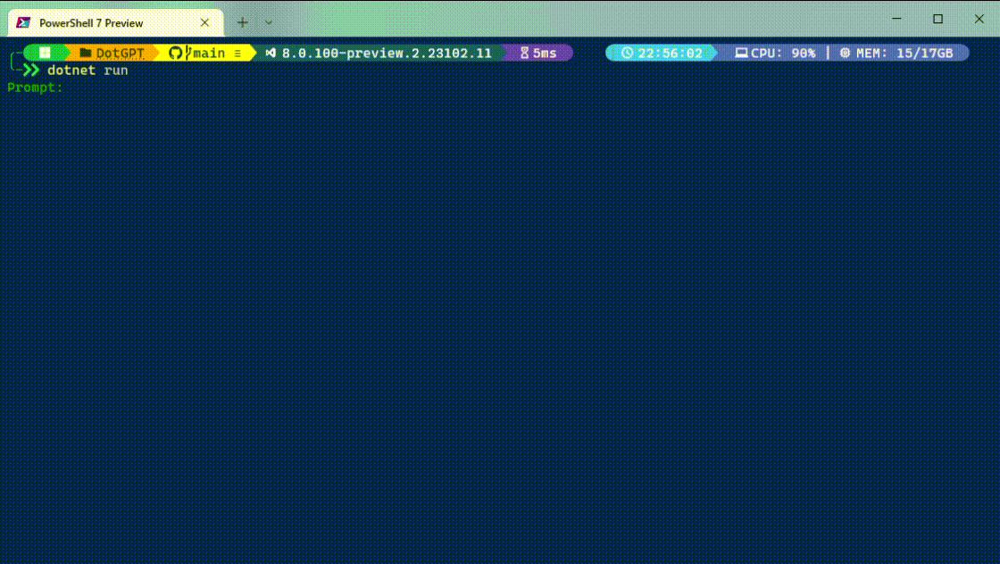

# DotGPT 🤖

Terminal .NET application that interacts with ChatGPT.

## About 🧾

DotGPT is simple console application that allows user to connect to ChatGPT3 via terminal and interact with it.

Currently app can be used by:

- `gpt` - this command will open interactive mode when you can type your request through terminal
- `gpt "Is C# fast?"` - this command will ask ChatGPT3 for response and then return it's output to user
- `gpt -a` - this command will ask for all request parameters (instead of deafult ones), then call ChatGpt and return response to user

## Instalation 🔧
